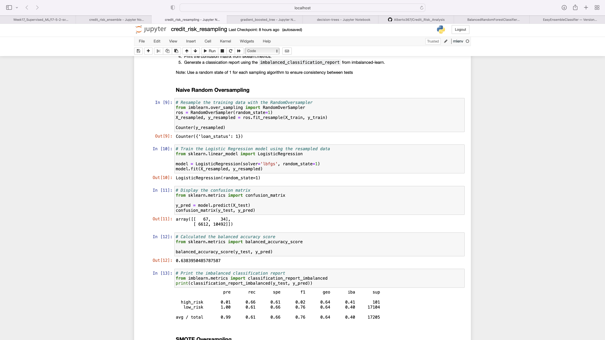
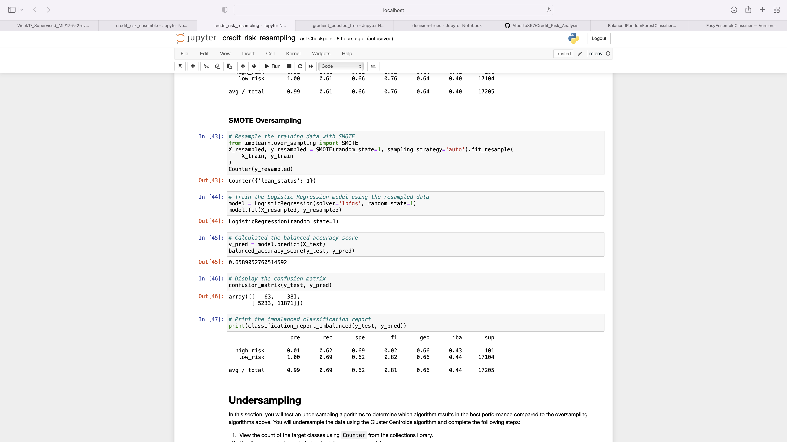
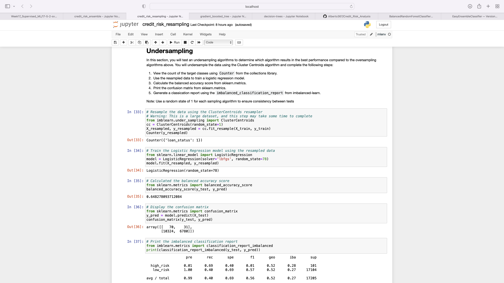
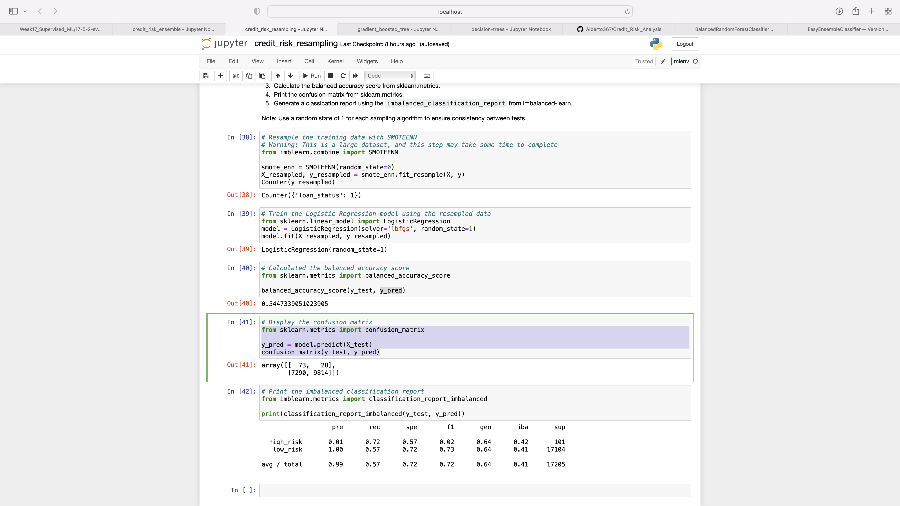
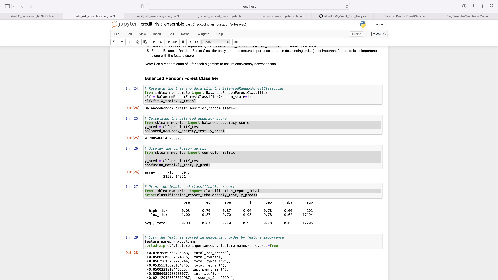
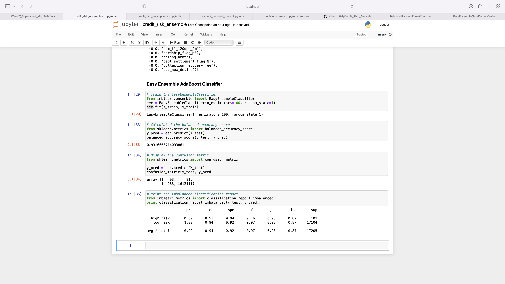

# Credit_Risk_Analysis
## Overview
In this project we used machine learning in an inherently unbalanced classification problem, credit risk. Good loans easily outnumber risky loans so we employed different techniques to train and evaluate models with unbalanced classes. We then evaluated the performance of these models to make recommendations on risk assessment.

## Results
### Random Over Sampler

- Balanced accuracy score: 0.64 
- High risk precision score: 0.01 
- High risk recall score: 0.66 

### SMOTE

- Balanced accuracy score: 0.66 
- High risk precision score: 0.01 
- High risk recall score: 0.62

### Cluster Centroids

- Balanced accuracy score: 0.65 
- High risk precision score: 0.01
- High risk recall score: 0.69

### SMOTEENN

- Balanced accuracy score: 0.54 
- High risk precision score: 0.01
- High risk recall score: 0.72

### Balanced Random Forest Classifier

- Balanced accuracy score: 0.79 
- High risk precision score: 0.03
- High risk recall score: 0.70

### Easy Ensemble Classifier

- Balanced accuracy score: 0.93 
- High risk precision score: 0.09
- High risk recall score: 0.92

A low precision is indicative of a large number of false positives

A low recall is indicative of a large number of false negatives.

## Summary
From our analysis of the machine learning models we can see that Random Over Sampler, SMOTE, and Cluster Centroids all had a precision score of 0.01 which is very bad. Furthermore, the recall and balance accuracy scores were all in the 60's range which is not much better. Smoteenn also had a precision score of 0.01 but a higher recall score of 0.72 which is not much better than the other models. Its balance accuracy score of 0.54 was actually worse than the other models. Balanced Random Forest Classifier had a slightly higher precision score of 0.03 a recall of .70 and a balanced accuracy score of 0.79 which are all better scores, but still not enough to be a reliable model. Finally the Easy Ensemble Classifier had a balanced accuracy score of 0.93 which means the model can accurately classify True positives and True negatives 93% of the time. The recall score was also good at 0.92 meaning it has a low number of false negatives but the precision score was only 0.09 meaning it still has a high number of false positives. The Easy Ensemble Classifier model would be the only viable option for credit risk analysis because it has a high balance and recall scores. The recall score is important to be high because if it was low it would be more likely to falsely classify a high risk loan as low risk. The precision score of 0.09 is not ideal however, because a low precision score means a large number of false positives the model would classify more low risk loans as high risk which isn't so bad.